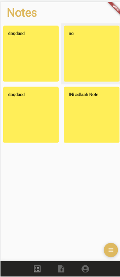
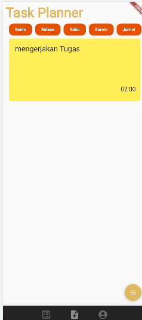
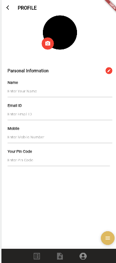

# Note App
this project is a note application where users can create a note in this application. besides that this application also supports users to create a daily schedule. this project work was carried out for the final project exam for the mobile computing course.
# Tools that i use
- Dart.
- Flutter.
- Cloud Firestore.
- Firebase auth.
# Documentation
 

    
    
    
  </a>

 
